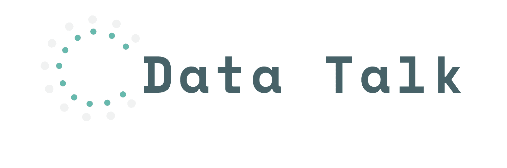

# DATA-TALK  



DATA-TALK旨在通过数据讲述世界
+ 使用vue3作为前端框架
+ 使用vite作为脚手架
+ 通过axios请求后端数据

## Installation
```
git clone https://github.com/HLGhpz/Data-Talk
pnpm install
pnpm dev
```
## Changelog
Detailed changes for each release are documented in the [release notes](https://github.com/HLGhpz/Data-Talk/blob/main/CHANGELOG.md).
## License
Data-Talk is MIT licensed.